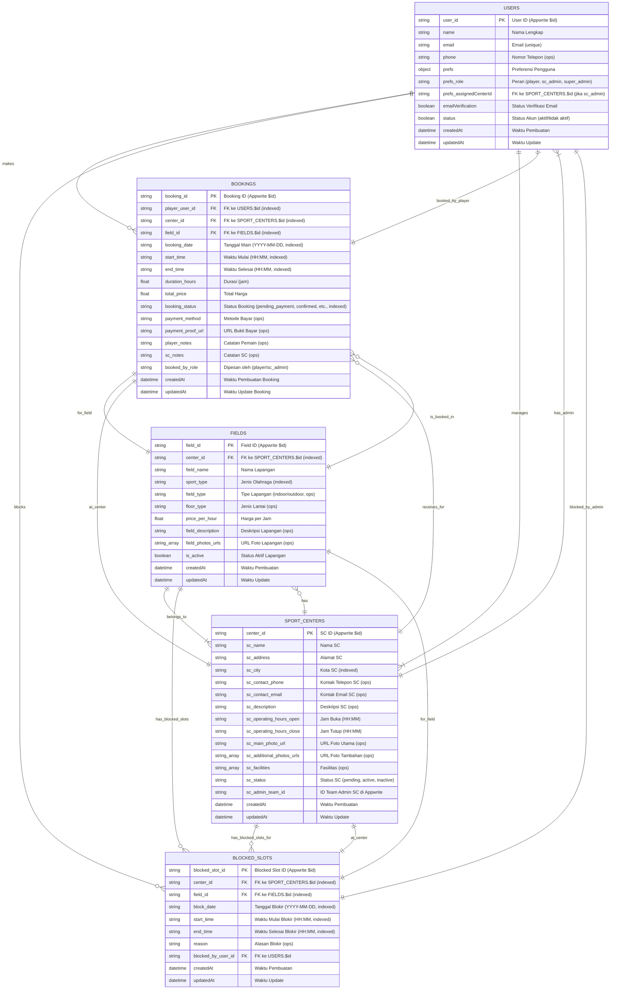

# ERD: Aplikasi Pemesanan Lapangan Olahraga
## Entitas & Atribut beserta detail dan hubungan antar collection:

**Aturan Umum Permissions:**
*   **`role:super_admin`**: Biasanya memiliki CRUD penuh pada semua collection untuk keperluan administrasi.
*   **`team:sc_[centerId]_admins`**: Tim yang berisi ID user admin dari SC tertentu. Digunakan untuk memberikan akses CRUD ke data milik SC tersebut.
*   **`user:[userId]`**: Memberikan akses kepada pengguna spesifik (pemilik dokumen).
*   **`role:player`**: Memberikan akses baca umum atau hak buat terbatas.

---

**5.1. Collection: `users`**
*   **Tujuan:** Menyimpan data semua pengguna (Pemain, Admin SC, Super Admin).
*   **Atribut:**
    *   `$id` (string, PK, otomatis oleh Appwrite): ID unik pengguna.
    *   `$createdAt` (datetime, otomatis): Waktu pembuatan.
    *   `$updatedAt` (datetime, otomatis): Waktu update terakhir.
    *   `name` (string, wajib): Nama lengkap pengguna.
    *   `email` (string, wajib, unik, indexed): Alamat email pengguna (untuk login).
    *   `emailVerification` (boolean, otomatis): Status verifikasi email.
    *   `password` (string, otomatis, hashed): Password pengguna (dikelola Appwrite).
    *   `phone` (string, opsional): Nomor telepon pengguna.
    *   `prefs` (object, otomatis): Preferensi pengguna (bisa berisi `role` dan `assignedCenterId`).
        *   `role` (string, wajib, enum: `player`, `pending_sc_admin`, `sc_admin`, `super_admin`): Peran pengguna dalam sistem.
        *   `assignedCenterId` (string, opsional, FK ke `sport_centers.$id`): Diisi jika `role` adalah `sc_admin`, menunjukkan SC yang dikelola.
    *   `status` (boolean, otomatis): Status akun (aktif/tidak aktif).
*   **Permissions Dokumen Default:**
    *   Read: `role:super_admin`, `user:$id`
    *   Update: `role:super_admin`, `user:$id` (Pengguna bisa update profil sendiri)
    *   Delete: `role:super_admin`
*   **Relasi:**
    *   `prefs.assignedCenterId` -> `sport_centers.$id` (Satu Admin SC mengelola satu SC - untuk MVP).

---

**5.2. Collection: `sport_centers` (SC)**
*   **Tujuan:** Menyimpan data detail setiap Sports Center (tenant).
*   **Atribut:**
    *   `$id` (string, PK, otomatis): ID unik SC.
    *   `$createdAt` (datetime, otomatis): Waktu pembuatan.
    *   `$updatedAt` (datetime, otomatis): Waktu update terakhir.
    *   `sc_name` (string, wajib, indexed): Nama resmi Sports Center.
    *   `sc_address` (string, wajib): Alamat lengkap SC.
    *   `sc_city` (string, wajib, indexed): Kota lokasi SC (untuk pencarian).
    *   `sc_contact_phone` (string, opsional): Nomor telepon kontak SC.
    *   `sc_contact_email` (string, opsional): Email kontak SC.
    *   `sc_description` (string, opsional, teks panjang): Deskripsi tentang SC.
    *   `sc_operating_hours_open` (string, wajib, format "HH:MM"): Jam buka SC.
    *   `sc_operating_hours_close` (string, wajib, format "HH:MM"): Jam tutup SC.
    *   `sc_main_photo_url` (string, opsional): URL ke foto utama SC (dari Appwrite Storage).
    *   `sc_additional_photos_urls` (array of strings, opsional): Daftar URL ke foto tambahan SC.
    *   `sc_facilities` (array of strings, opsional): Daftar fasilitas (misal: "Parkir", "Toilet", "Kantin").
    *   `sc_status` (string, wajib, enum: `pending_approval`, `active`, `inactive`, `suspended`, indexed): Status SC.
    *   `sc_admin_team_id` (string, wajib): ID Team Appwrite (`sc_[$id]_admins`) yang berisi admin(s) untuk SC ini.
*   **Permissions Dokumen Default:**
    *   Read: `role:super_admin`, `role:player`, `team:[sc_admin_team_id]`
    *   Create: `role:super_admin` (atau Function yang dipicu oleh `pending_sc_admin` yang disetujui)
    *   Update: `role:super_admin`, `team:[sc_admin_team_id]`
    *   Delete: `role:super_admin`
*   **Relasi:**
    *   Memiliki banyak `fields`.
    *   Dikelola oleh pengguna dalam `team:[sc_admin_team_id]`.

---

**5.3. Collection: `fields` (Lapangan)**
*   **Tujuan:** Menyimpan data detail setiap lapangan milik Sports Center.
*   **Atribut:**
    *   `$id` (string, PK, otomatis): ID unik lapangan.
    *   `$createdAt` (datetime, otomatis): Waktu pembuatan.
    *   `$updatedAt` (datetime, otomatis): Waktu update terakhir.
    *   `center_id` (string, wajib, FK ke `sport_centers.$id`, indexed): ID SC pemilik lapangan ini.
    *   `field_name` (string, wajib): Nama lapangan (misal: "Lapangan Futsal A", "Badminton Indoor 1").
    *   `sport_type` (string, wajib, enum: `futsal`, `badminton`, `basketball`, `volleyball`, `tennis`, indexed): Jenis olahraga utama lapangan.
    *   `field_type` (string, opsional, enum: `indoor`, `outdoor`): Jenis lapangan (indoor/outdoor).
    *   `floor_type` (string, opsional): Jenis lantai (misal: "Sintetis", "Vinyl", "Semen").
    *   `price_per_hour` (number, wajib, float): Harga sewa per jam.
    *   `field_description` (string, opsional): Deskripsi singkat lapangan.
    *   `field_photos_urls` (array of strings, opsional): Daftar URL ke foto-foto lapangan.
    *   `is_active` (boolean, wajib, default: true): Status aktif/tidak aktif lapangan.
*   **Permissions Dokumen Default:**
    *   Read: `role:super_admin`, `role:player`, `team:[center_id]_admins` (Asumsi Team ID mengikuti pola `sc_[center_id]_admins`)
    *   Create: `role:super_admin`, `team:[center_id]_admins`
    *   Update: `role:super_admin`, `team:[center_id]_admins`
    *   Delete: `role:super_admin`, `team:[center_id]_admins`
*   **Relasi:**
    *   Dimiliki oleh satu `sport_centers` (via `center_id`).
    *   Memiliki banyak `bookings`.
    *   Memiliki banyak `blocked_slots`.

---

**5.4. Collection: `bookings` (Pemesanan)**
*   **Tujuan:** Menyimpan data setiap transaksi pemesanan lapangan.
*   **Atribut:**
    *   `$id` (string, PK, otomatis): ID unik pemesanan.
    *   `$createdAt` (datetime, otomatis): Waktu pemesanan dibuat.
    *   `$updatedAt` (datetime, otomatis): Waktu update terakhir.
    *   `player_user_id` (string, wajib, FK ke `users.$id`, indexed): ID pengguna (pemain) yang memesan.
    *   `center_id` (string, wajib, FK ke `sport_centers.$id`, indexed): ID SC tempat lapangan dipesan (denormalisasi untuk query).
    *   `field_id` (string, wajib, FK ke `fields.$id`, indexed): ID lapangan yang dipesan.
    *   `booking_date` (string, wajib, format "YYYY-MM-DD", indexed): Tanggal bermain.
    *   `start_time` (string, wajib, format "HH:MM", indexed): Waktu mulai bermain.
    *   `end_time` (string, wajib, format "HH:MM", indexed): Waktu selesai bermain.
    *   `duration_hours` (number, wajib, float): Durasi sewa dalam jam.
    *   `total_price` (number, wajib, float): Total harga pemesanan.
    *   `booking_status` (string, wajib, enum: `pending_payment`, `confirmed`, `cancelled_by_player`, `cancelled_by_sc`, `completed`, `payment_rejected`, `waiting_for_sc_confirmation`, indexed): Status pemesanan.
    *   `payment_method` (string, opsional, enum: `on_the_spot`, `bank_transfer`): Metode pembayaran (untuk MVP).
    *   `payment_proof_url` (string, opsional): URL ke bukti pembayaran jika `bank_transfer`.
    *   `player_notes` (string, opsional): Catatan dari pemain.
    *   `sc_notes` (string, opsional): Catatan dari admin SC terkait booking ini.
    *   `booked_by_role` (string, wajib, enum: `player`, `sc_admin`): Siapa yang membuat booking (pemain atau admin SC untuk booking manual).
*   **Permissions Dokumen Default:**
    *   Read: `role:super_admin`, `user:[player_user_id]`, `team:[center_id]_admins`
    *   Create: `role:player`, `team:[center_id]_admins`
    *   Update: `role:super_admin`, `user:[player_user_id]` (hanya untuk status tertentu seperti `cancelled_by_player`), `team:[center_id]_admins` (untuk konfirmasi, pembatalan oleh SC)
    *   Delete: `role:super_admin` (pembatalan keras, jarang digunakan)
*   **Relasi:**
    *   Dibuat oleh satu `users` (pemain).
    *   Merujuk ke satu `fields` dan satu `sport_centers`.

---

**5.5. Collection: `blocked_slots` (Slot Waktu Diblokir Admin SC)**
*   **Tujuan:** Menyimpan informasi slot waktu yang diblokir oleh Admin SC (misal untuk maintenance, acara internal).
*   **Atribut:**
    *   `$id` (string, PK, otomatis): ID unik slot diblokir.
    *   `$createdAt` (datetime, otomatis): Waktu pembuatan.
    *   `$updatedAt` (datetime, otomatis): Waktu update terakhir.
    *   `center_id` (string, wajib, FK ke `sport_centers.$id`, indexed): ID SC.
    *   `field_id` (string, wajib, FK ke `fields.$id`, indexed): ID lapangan yang slotnya diblokir.
    *   `block_date` (string, wajib, format "YYYY-MM-DD", indexed): Tanggal slot diblokir.
    *   `start_time` (string, wajib, format "HH:MM", indexed): Waktu mulai blokir.
    *   `end_time` (string, wajib, format "HH:MM", indexed): Waktu selesai blokir.
    *   `reason` (string, opsional): Alasan pemblokiran slot.
    *   `blocked_by_user_id` (string, wajib, FK ke `users.$id`): ID Admin SC yang melakukan blokir.
*   **Permissions Dokumen Default:**
    *   Read: `role:super_admin`, `role:player` (aplikasi akan query ini untuk menentukan ketersediaan), `team:[center_id]_admins`
    *   Create: `role:super_admin`, `team:[center_id]_admins`
    *   Update: `role:super_admin`, `team:[center_id]_admins`
    *   Delete: `role:super_admin`, `team:[center_id]_admins`
*   **Relasi:**
    *   Merujuk ke satu `fields` dan satu `sport_centers`.
    *   Dibuat oleh satu `users` (Admin SC).

---
