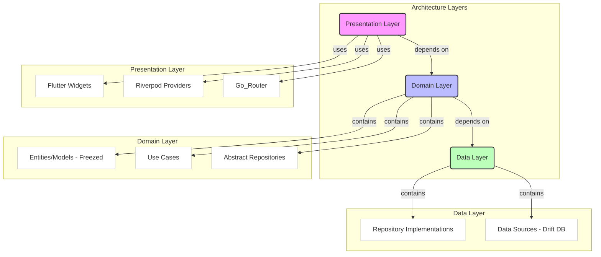
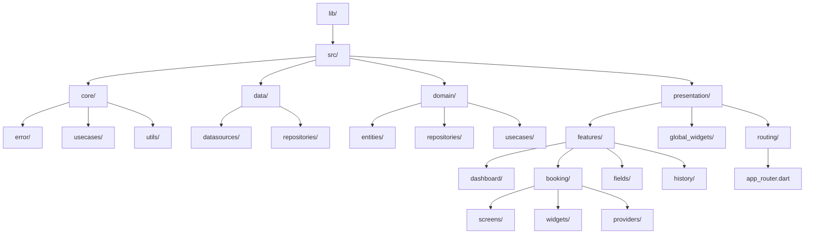

# Software Design Document (SDD): Aplikasi Pemesanan Lapangan Olahraga
**Versi:** 1.0  
**Tanggal:** 17 September 2025  
**Author:**
- Ahmad Rois (221240001239)
- M. Gilang M.W. Sabdokafi (221240001248)

**Status:** Draft  
---

## 1. Pendahuluan

### 1.1 Tujuan
Dokumen ini menyediakan desain teknis tingkat tinggi dan rendah untuk **"Aplikasi Pemesanan Lapangan Olahraga"**. Tujuannya adalah memberikan panduan bagi tim pengembang dalam mengimplementasikan perangkat lunak sesuai dengan SRS v1.0. Dokumen ini mencakup arsitektur perangkat lunak, desain komponen, desain data, serta strategi teknis.

### 1.2 Ruang Lingkup
Desain ini mencakup seluruh fungsionalitas yang didefinisikan dalam SRS: manajemen lapangan, pemesanan, kelola status booking, dan riwayat pemesanan. Stack teknologi yang digunakan: **Flutter, Riverpod Generator, Freezed, Go_Router, fpdart, Drift, logger**.

---

## 2. Desain Arsitektur Sistem

### 2.1 Tinjauan Arsitektur
Aplikasi ini mengadopsi arsitektur **Clean Architecture** yang dipisah menjadi tiga lapisan utama: **Presentation, Domain, dan Data**.  

**Aturan Ketergantungan (Dependency Rule):**  
- Presentation hanya boleh bergantung pada Domain.  
- Domain independen dari UI maupun database.  
- Data layer bergantung pada Domain (repository contracts).  

### 2.2 Deskripsi Lapisan
- **Presentation Layer**  
  - Komponen: Screens/Widgets (Flutter), State (Riverpod), Routing (Go_Router).  
  - Tugas: Menampilkan data, menangkap input, dan mengoperasikan use case.  

- **Domain Layer**  
  - Komponen: Entities (Freezed models), Use Cases, Abstract Repositories.  
  - Tugas: Menyimpan logika bisnis inti, validasi pemesanan (jadwal tidak bentrok).  

- **Data Layer**  
  - Komponen: Repository Implementation, Drift Database (Tables + DAOs).  
  - Tugas: Interaksi dengan database lokal, memberikan data ke Domain.  

---

## 3. Desain Komponen Rinci

### 3.1 Presentation Layer
- **Struktur UI**  
  - Screens:  
    - `DashboardScreen` → menampilkan daftar booking aktif.  
    - `BookingFormScreen` → form tambah booking.  
    - `HistoryScreen` → riwayat booking (batal/selesai).  
    - `FieldListScreen` → daftar lapangan.  
  - Widgets reusable: form field, card booking, kalender jadwal.  

- **State Management (Riverpod Generator)**  
  - Provider untuk setiap fitur (mis. `bookingProvider`, `fieldProvider`).  
  - Data booking real-time diekspos dengan **StreamProvider** dari Drift DAO.  
  - Event: Tambah, Ubah Status, Hapus booking → dipanggil lewat `Notifier`.  

- **Navigasi (Go_Router)**  
  - Rute:  
    - `/` → Dashboard  
    - `/booking/add` → Form booking  
    - `/booking/history` → Riwayat  
    - `/fields` → Manajemen lapangan  

### 3.2 Domain Layer
- **Entities (Freezed)**  
  - `Field`: { id, nama, jenis (Futsal/Badminton/Voli) }  
  - `Booking`: { id, namaPemesan, lapanganId, tanggal, jamMulai, jamSelesai, status }  
  - `StatusBooking`: enum { Aktif, Batal, Selesai }  

- **Abstract Repositories (Contracts)**  
  - `IBookingRepository`:  
    - `Stream<List<Booking>> watchBookingsByDate(DateTime date)`  
    - `Future<Either<Failure, Unit>> addBooking(Booking booking)`  
    - `Future<Either<Failure, Unit>> updateStatus(int id, StatusBooking status)`  
  - `IFieldRepository`:  
    - `Stream<List<Field>> watchFields()`  
    - `Future<Either<Failure, Unit>> addField(Field field)`  

- **Use Cases**  
  - `CreateBooking`  
  - `CancelBooking`  
  - `CompleteBooking`  
  - `GetBookingsByDate`  
  - `GetFields`  

### 3.3 Data Layer
- **Repository Implementations**  
  - `BookingRepositoryImpl` → implementasi `IBookingRepository` dengan Drift DAO.  
  - `FieldRepositoryImpl` → implementasi `IFieldRepository`.  

- **Data Sources (Drift)**  
  - Tables:  
    - `FieldsTable` (id, nama, jenis).  
    - `BookingsTable` (id, namaPemesan, fieldId, tanggal, jamMulai, jamSelesai, status).  
  - DAO:  
    - `FieldDao`: CRUD lapangan.  
    - `BookingDao`: CRUD booking + query cek jadwal bentrok.  

---

## 4. Desain Data (Database)

- **Skema Database (Drift)**  
  - Tabel **Fields**  
    - `id` (PK, autoincrement)  
    - `nama` (TEXT)  
    - `jenis` (ENUM: futsal, badminton, voli)  

  - Tabel **Bookings**  
    - `id` (PK, autoincrement)  
    - `namaPemesan` (TEXT)  
    - `fieldId` (FK → Fields.id)  
    - `tanggal` (DATE)  
    - `jamMulai` (TIME)  
    - `jamSelesai` (TIME)  
    - `status` (ENUM: aktif, batal, selesai)  

- **Relasi**  
  - Satu lapangan bisa punya banyak booking.  
  - Constraint: booking baru tidak boleh overlap pada lapangan yang sama.  

- **Migrasi**  
  - Drift menyediakan schema migration untuk update tabel di versi berikutnya.  

---

## 5. Strategi Penanganan Error

- **Pendekatan:** gunakan `fpdart` untuk hasil `Either<Failure, Success>`.  
- **Alur:**  
  - Data Layer → return `Future<Either<Failure, T>>`.  
  - Domain Layer → meneruskan hasil.  
  - Presentation → provider akan memetakan hasil ke state (Loading, Success, Error).  
- **Tipe Failure**:  
  - `DatabaseFailure` → error query/migrasi.  
  - `ValidationFailure` → booking bentrok.  
  - `UnknownFailure` → error tidak terduga.  

---

## 6. Struktur Proyek (Direktori)

---